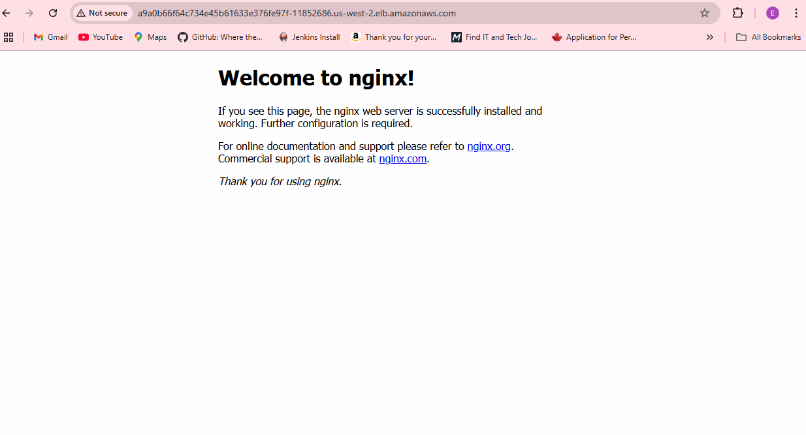
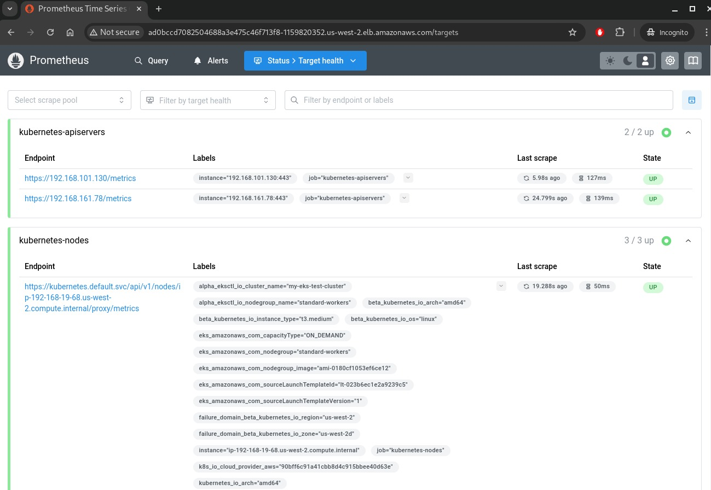
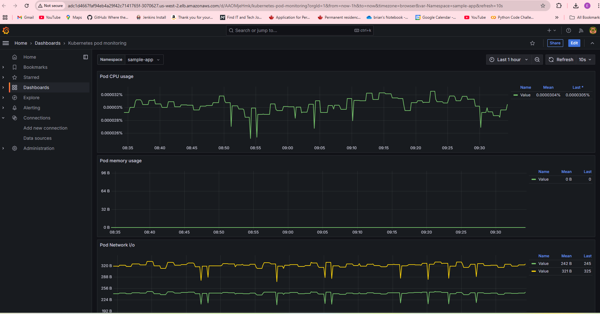
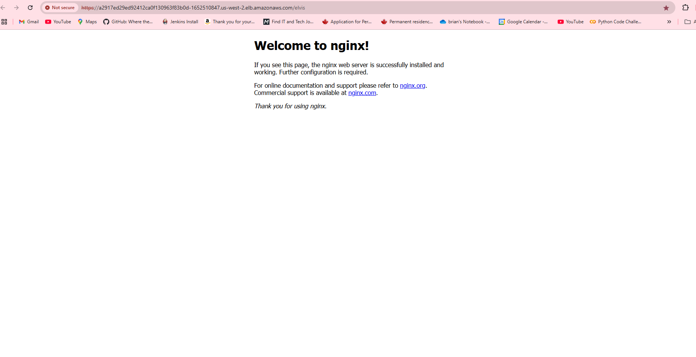

# Project: EKS Cluster Deployment and CI/CD Pipeline with Monitoring
## Task 1:  Set Up Infrastructure
This project involves provisioning an Amazon EKS (Elastic Kubernetes Service) cluster in AWS using Terraform.
*Instructions:*
1.	Prerequisites:
- 	Ensure you have AWS CLI, Terraform, and Jenkins installed and configured.
-	AWS credentials should be set up using AWS CLI or environment variables.
-	An AWS account with appropriate IAM permissions to create EKS resources.
-	Jenkins synchronized with AWS to execute automated pipeline application deployment to EKS cluster
2.	Setup Terraform:
-	Created terraform configurations, the terraform repository and navigate to the Terraform configuration directory.
-	Review the variables.tf file and provide any necessary values (e.g., AWS region, VPC settings).
-	Apply the Terraform configuration to create the EKS cluster:
-	After the Terraform deployment completes, run the following to configure kubectl to view and use the new EKS cluster:
```
aws eks --region us-west-2 update-kubeconfig --name my-eks-test-cluster
```
3.	Verify EKS Cluster:
-	Ensure the EKS cluster is up and running by checking the nodes:
```
kubectl get nodes
```

## Task2 : Deploy the Application

The next step involves deploying a basic web application (e.g., Nginx) to the EKS cluster.
Instructions:
1.	Deploy Using Kubernetes Manifests:
- Apply the Nginx deployment using helm:
```
kubectl create namespace sample-app
helm install elvis-sample-app elvis-sample-app –namespace sample-app
```
-	Check if the deployment was successful:
```
kubectl get all -n sample-app
NAME                            READY   STATUS    RESTARTS   AGE
pod/elvis-sample-app-65565b48c8-5dgsn   1/1     Running   0          20h

NAME               TYPE        CLUSTER-IP      EXTERNAL-IP   PORT(S)   AGE
service/elvis-sample-app   ClusterIP   10.100.97.127   <none>        80/TCP    20h

NAME                       READY   UP-TO-DATE   AVAILABLE   AGE
deployment.apps/elvis-sample-app   1/1     1            1           20h

NAME                                  DESIRED   CURRENT   READY   AGE
replicaset.apps/elvis-sample-app-65565b48c8   1         1         1       20h
replicaset.apps/elvis-sample-app-847f454bcd   0         0         0       20h
```
                        
-	Verify Deployment:
o	Get the external IP or DNS of the service:
```
kubectl get svc nginx-service -n sample-app
NAME       TYPE           CLUSTER-IP      EXTERNAL-IP                                                             PORT(S)        AGE
elvis-sample-app   LoadBalancer   10.100.97.127   a9a0b66f64c734e45b61633e376fe97f-11852686.us-west-2.elb.amazonaws.com   80:32063/TCP   20h
```
-	Access the application through the external IP or DNS in a browser.



## Task3: CI/CD Pipeline : Set up a CI/CD pipeline using GitHub Actions to automate the deployment to the EKS cluster.
Instructions:
- Setup a jenkins server and ensure it is running. 
- Create a enkins Credential to store AWS credentials used to deploy the EKS Cluster.
- Create a new jenkins job using  the `jenkinsfile` (available under monitoring directory)
*Assumptions*: 
* helm chart is available in jenkins server (an enhancement to the pipline would be to retrieve the code from github).

## Task4:  Monitoring: Integrate Prometheus and Grafana for monitoring the web application.
Instructions:
1.	Deploy Prometheus and Grafana:
- Add `prometheus` and `grafana` helm charts 

```
# add prometheus Helm repo
helm repo add prometheus-community https://prometheus-community.github.io/helm-charts

# add grafana Helm repo
helm repo add grafana https://grafana.github.io/helm-charts
```

- Deploy Prometheus in the cluster

```
kubectl create namespace prometheus

helm install prometheus prometheus-community/prometheus \
    --namespace prometheus \
    --set alertmanager.persistentVolume.storageClass="gp2" \
    --set server.persistentVolume.storageClass="gp2" \
    --set server.service.type="LoadBalancer"

```
- Check prometheus deploymenet

```
kubectl get pods,svc -n prometheus 

NAME                                                     READY   STATUS    RESTARTS   AGE
pod/prometheus-alertmanager-0                            0/1     Pending   0          21h
pod/prometheus-kube-state-metrics-8ff4967cb-dbjjd        1/1     Running   0          21h
pod/prometheus-prometheus-node-exporter-4kzgz            1/1     Running   0          21h
pod/prometheus-prometheus-node-exporter-d89dc            1/1     Running   0          21h
pod/prometheus-prometheus-node-exporter-h4qb5            1/1     Running   0          21h
pod/prometheus-prometheus-pushgateway-7d7b6497cd-5t8tj   1/1     Running   0          21h
pod/prometheus-server-77cc4c5b98-9d475                   2/2     Running   0          20h

NAME                                          TYPE           CLUSTER-IP       EXTERNAL-IP                                                               PORT(S)        AGE
service/prometheus-alertmanager               ClusterIP      10.100.245.187   <none>                                                                    9093/TCP       21h
service/prometheus-alertmanager-headless      ClusterIP      None             <none>                                                                    9093/TCP       21h
service/prometheus-kube-state-metrics         ClusterIP      10.100.97.156    <none>                                                                    8080/TCP       21h
service/prometheus-prometheus-node-exporter   ClusterIP      10.100.158.252   <none>                                                                    9100/TCP       21h
service/prometheus-prometheus-pushgateway     ClusterIP      10.100.193.27    <none>                                                                    9091/TCP       21h
service/prometheus-server                     LoadBalancer   10.100.36.164    ad0bccd7082504688a3e475c46f713f8-1159820352.us-west-2.elb.amazonaws.com   80:30284/TCP   21h
```
- Check promotherus targets 




- deploy Grafana using Helm chart
```
kubectl create namespace grafana

helm install grafana grafana/grafana \
    --namespace grafana \
    --set persistence.storageClassName="gp2" \
    --set persistence.enabled=true \
    --set adminPassword='MyPa55!' \
    --values ./grafana.yaml \
    --set service.type=LoadBalancer
```
- verify Grafana deployment

```
kubectl get all -n grafana
NAME                           READY   STATUS    RESTARTS   AGE
pod/grafana-798cc8d458-v4k4g   1/1     Running   0          20h

NAME              TYPE           CLUSTER-IP     EXTERNAL-IP                                                            PORT(S)        AGE
service/grafana   LoadBalancer   10.100.2.144   adc1d4667faf94eb4a29f42c7141765f-3070627.us-west-2.elb.amazonaws.com   80:31495/TCP   20h

NAME                      READY   UP-TO-DATE   AVAILABLE   AGE
deployment.apps/grafana   1/1     1            1           20h

NAME                                 DESIRED   CURRENT   READY   AGE
replicaset.apps/grafana-798cc8d458   1         1         1       20h
```

- Accessing Grafana and Creating a dashboard
- Use the provided json file (grafana-dashboard.json) to import the dashbord.




## Task 5:  HAProxy Ingress Configuration for External Access


Install and configure HAProxy Ingress Controller for external access to the application.
Instructions:

- Add the HAProxy Technologies Helm repository:

```
helm repo add haproxytech https://haproxytech.github.io/helm-charts
```

- Install the latest version of the ingress controller. Set controller.service.type to LoadBalancer:

```
helm install haproxy-kubernetes-ingress haproxytech/kubernetes-ingress \
  --create-namespace \
  --namespace haproxy-controller \
  --set controller.service.type=LoadBalancer
```

- Verify HAproxy ingressController deployment
```
kubectl get all -n haproxy-controller
NAME                                              READY   STATUS    RESTARTS   AGE
pod/haproxy-kubernetes-ingress-56559fbbd7-rswmq   1/1     Running   0          21h
pod/haproxy-kubernetes-ingress-56559fbbd7-smblm   1/1     Running   0          21h

NAME                                 TYPE           CLUSTER-IP      EXTERNAL-IP                                                               PORT(S)                      AGE
service/haproxy-kubernetes-ingress   LoadBalancer   10.100.255.76   a2917ed29ed92412ca0f130963f83b0d-1652510847.us-west-2.elb.amazonaws.com   80:32482/TCP,443:30840/TCP   21h

NAME                                         READY   UP-TO-DATE   AVAILABLE   AGE
deployment.apps/haproxy-kubernetes-ingress   2/2     2            2           21h

NAME                                                    DESIRED   CURRENT   READY   AGE
replicaset.apps/haproxy-kubernetes-ingress-56559fbbd7   2         2         2       21h
```

- Test: Create an ingress for the sample app 
```yaml 
apiVersion: networking.k8s.io/v1
kind: Ingress
metadata:
  annotations:
    haproxy.org/path-rewrite: /
  name: elvis-sample-app
  namespace: sample-app
spec:
  ingressClassName: haproxy
  rules:
  - host: a2917ed29ed92412ca0f130963f83b0d-1652510847.us-west-2.elb.amazonaws.com
    http:
      paths:
      - backend:
          service:
            name: elvis-sample-app
            port:
              number: 80
        path: /elvis
        pathType: ImplementationSpecific
```

- Test access to the ingress on `/elvis` path: 



## Task6:  Database Setup: Deploy a simple Redis or MySQL/PostgreSQL database and connect the application.
Instructions:

kubectl apply -f k8s/redis-deployment.yaml
2.	Configure Application to Use Redis:
o	Modify the application’s configuration to connect to the Redis database by updating environment variables or configuration files.
o	For example, configure the connection string to point to the Redis service within the Kubernetes cluster.
3.	Verify Database Connection:
- Apply Mysql manifests available under `database-deployment` directory: 
```
cd database-deployment 
kubectl create namespace database
kubectl create -f ./
```
- verify Mysql deployment 
```
kubectl get all -n database
NAME                         READY   STATUS    RESTARTS   AGE
pod/mysql-7cbdbd8956-vp9zf   1/1     Running   0          20h

NAME            TYPE        CLUSTER-IP      EXTERNAL-IP   PORT(S)    AGE
service/mysql   ClusterIP   10.100.49.103   <none>        3306/TCP   20h

NAME                    READY   UP-TO-DATE   AVAILABLE   AGE
deployment.apps/mysql   1/1     1            1           20h

NAME                               DESIRED   CURRENT   READY   AGE
replicaset.apps/mysql-7cbdbd8956   1         1         1       20h
```

#### To connect the application the database, we can use  Mysql service's DNS name: mysql.database.svc.cluser.local , using username admin and  password defined in the secret. 
_____
## Assumptions and Simplifications:
*	AWS account is pre-configured with necessary IAM roles and permissions.
*	Terraform configuration assumes the use of default VPC settings.
*	The Nginx web application is a simple placeholder for demonstration purposes.
*	The HAProxy Ingress is assumed to be exposed using DNS in this example.
*	Prometheus and Grafana are installed using Helm with default settings.

Challenges Faced and How They Were Solved:
1.	Issue with EKS Cluster Connectivity:
-	Initially, there were connectivity issues due to missing IAM permissions for the kubectl user. This was resolved by ensuring the appropriate eks:DescribeCluster and eks:ListClusters permissions were granted.
2.	Helm Chart Compatibility:
-	Some Helm charts had issues with Kubernetes version compatibility. This was solved by ensuring the correct chart version was used, matching the Kubernetes version of the EKS cluster.
3.	Ingress Resource Configuration:
-	Setting up the HAProxy Ingress with DNS was challenging because the external IP was not immediately assigned. This was resolved by delete some defnied ports in the service. 

